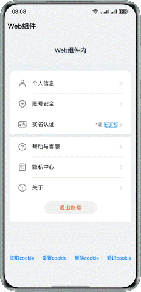

# 实现应用免密登录的功能

### 简介

本篇Codelab通过Web、WebCookie、WebCookieManager组件实现一个应用免密登录的场景，帮助开发者掌握ArkUI的cookie管理操作。

### 相关概念

- Web：提供网页显示能力的组件。
- WebCookieManager：通过WebCookie可以控制Web组件中的cookie的各种行为，其中每个应用中的所有web组件共享一个WebCookieManager实例。

### 相关权限

网络使用权限：ohos.permission.INTERNET。

### 使用说明

1.设备接入网络，主页会加载HarmonyOS官网登录界面。

2.点击读取cookie，可以获取当前的cookie信息，并弹框展示。

3.点击设置cookie，会设置cookie信息，设置成功弹出显示“写入cookie成功”，此时点击读取cookie信息，cookie信息弹窗中包含“info=测试cookie写入”的内容。

4.点击验证cookie，跳转至新界面。若在首页完成登录操作，则可跳转至“账户中心>关于”界面；若未登录，则跳转至登录界面。

### 约束与限制

1. 本示例仅支持标准系统上运行，支持设备：华为手机。
2. HarmonyOS系统：HarmonyOS 5.0.0 Release及以上。
3. DevEco Studio版本：DevEco Studio 5.0.0 Release及以上。
4. HarmonyOS SDK版本：HarmonyOS 5.0.0 Release SDK及以上。
