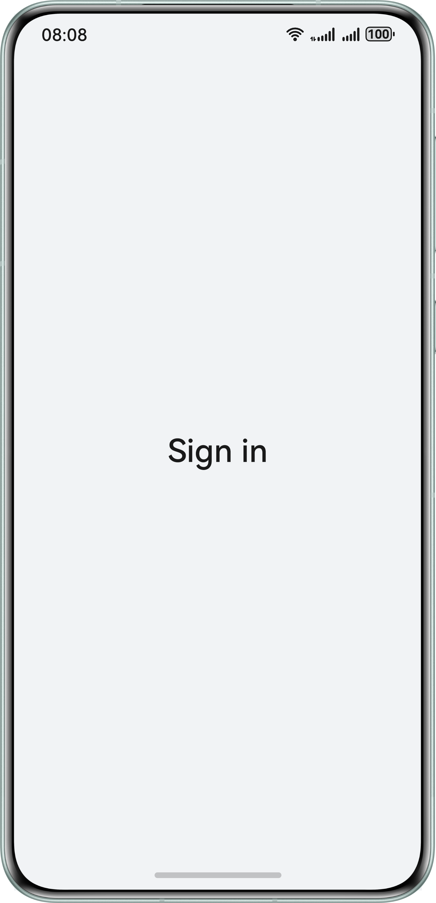
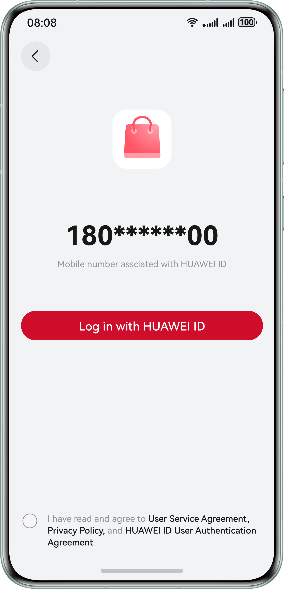
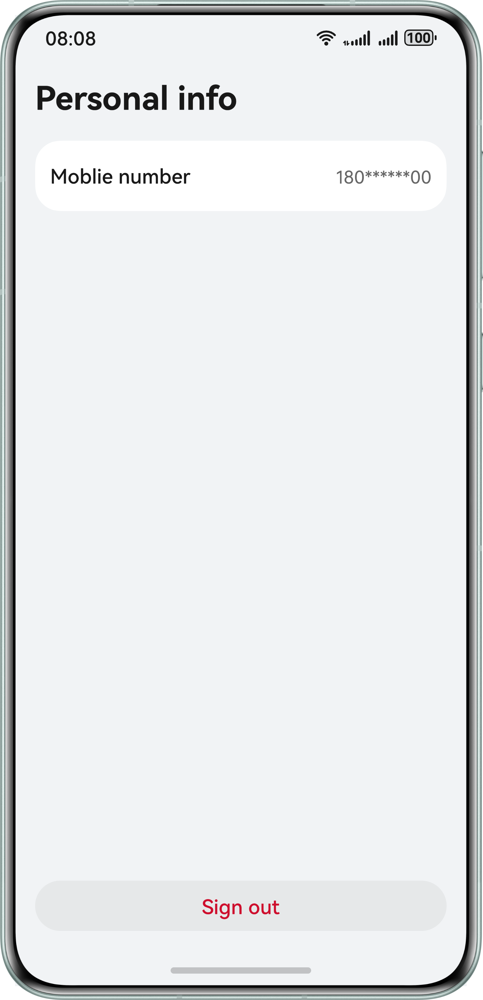

# Account Kit – One-Tap Sign In with HUAWEI ID

## Overview

This sample project illustrates how to use the capability provided by Account Kit for signing in to an app with HUAWEI ID through just one tap.

This sample project simulates the scenario where the one-tap sign-in **Button** component is called to bring up the sign-in screen that complies with Huawei specifications.

The API that you need to use is **@kit.AccountKit**.

## Preview

| **Sign-in screen**                         | **One-tap HUAWEI ID sign-in screen**       | **Personal info screen**                   |
|--------------------------------------------|--------------------------------------------|--------------------------------------------|
|  |  |  |

## How to Configure and Use the Sample Project

### Configuring the Sample Project in DevEco Studio

1. [Create a project](https://developer.huawei.com/consumer/en/doc/app/agc-help-createproject-0000001100334664). Under the project, [create an app](https://developer.huawei.com/consumer/en/doc/app/agc-help-createharmonyapp-0000001945392297).
2. In [HUAWEI Developers](https://developer.huawei.com/consumer/en/), configure the **quickLoginMobilePhone** scope for the app. For details, please refer to the [Account Kit Development Guide](https://developer.huawei.com/consumer/en/doc/harmonyos-guides/account-config-permissions).
3. Open the sample app in DevEco Studio and replace the value of **bundleName** in the **app.json5** file with the app package name specified in [AppGallery Connect](https://developer.huawei.com/consumer/en/service/josp/agc/index.html).
4. Replace the value of **client_id** in the **module.json5** file with the app's client ID configured in [AppGallery Connect](https://developer.huawei.com/consumer/en/service/josp/agc/index.html).
5. Generate an SHA-256 signing certificate fingerprint and configure it for the app in [AppGallery Connect](https://developer.huawei.com/consumer/en/service/josp/agc/index.html). For details, please refer to relevant instructions for [configuring signing information](https://developer.huawei.com/consumer/en/doc/harmonyos-guides/application-dev-overview#section42841246144813) and [adding a public key fingerprint](https://developer.huawei.com/consumer/en/doc/harmonyos-guides/application-dev-overview#section1726913517284) in the development preparations part.

### Using the Sample App
1. Run this sample app. If the signed-in HUAWEI ID is registered in the Chinese mainland and has been associated with a mobile number, the app, after getting the one-tap HUAWEI ID sign-in permission, will show the screen that provides a button for signing in with HUAWEI ID. Otherwise, an error message will be returned.
2. On the sign-in screen with the one-tap HUAWEI ID sign-in button, tap the **HUAWEI ID User Authentication Agreement** link to access the agreement screen.
3. After a successful sign-in, the personal information screen is displayed. The mobile number on this screen is for display purposes only and cannot be changed. You can also tap the sign-out button and then try all the operations above again.

## Project Directory

```
├─entry/src/main/ets        // Code area.
│ ├─common  
│ │ └─ShowToast.ets         // Public method for showing toast messages.
│ │ └─Constants.ets         // Stores constants.
│ ├─entryability  
│ │ └─EntryAbility.ets      // Entry point class.
│ ├─pages                   // Directory for storing app UI files.
│ │ └─HomePage.ets          // Home screen, which serves as the container for navigation jumps.
│ │ └─PrepareLoginPage.ets  // Main screen, covering scenarios such as obtaining the anonymous mobile number.
│ │ └─PersonalInfoPage.ets  // Personal info screen, including the mobile number and sign-out button.
│ │ └─ProtocolWebView.ets   // HUAWEI ID User Authentication Agreement screen
│ │ └─QuickLoginPage.ets    // One-tap HUAWEI ID sign-in screen
└──entry/src/main/resources // Resources
```

## How to Implement

Store constants in **Constants**. For details, please refer to **Constants.ets**.
* Common error codes are included.

Store the public method for showing toast messages in **ShowToast**. For details, please refer to **ShowToast.ets**.
* Use **promptAction.showToast()** to display a message.

Use **HomePage** to serve as the container for navigation jumps. For details, please refer to **HomePage.ets**.
* Use **NavPathStack** together with the **navDestination** attribute for navigation jumps.

Use **PrepareLoginPage** as the main screen. For details, please refer to **PrepareLoginPage.ets**.
* Use **authentication.HuaweiIDProvider().createAuthorizationWithHuaweiIDRequest()** to create an authorization request and obtain the anonymous mobile number.
* Use **authentication.AuthenticationController()** to create a controller.
* Call **controller.executeRequest()** to execute the request.

Call the one-tap HUAWEI ID sign-in component to show the sign-in screen that complies with Huawei specifications. This capability is provided in **QuickLoginPage**, and you can implement it by referring to **QuickLoginPage.ets**.
* Use **loginComponentManager.PrivacyText** to create a **privacyText** object for the **QuickLoginPage** component.
* Use **loginComponentManager.LoginWithHuaweiIDButtonController** to construct a controller object for **QuickLoginPage**.
* Use the **setAgreementStatus** method to set the agreement status (accepted or not) and determine whether one-tap HUAWEI ID sign-in can be performed based on the status.
* Set the **extraStyle** attribute in **param** in the **LoginWithHuaweiIDButton** component to enable the loading-after-a-tap status of the one-tap HUAWEI ID sign-in button.

Use the web component to show the *HUAWEI ID User Authentication Agreement* in **ProtocolWebView**.
* Obtain the web page link from **data.json**.

Use **PersonalInfoPage** as the personal information screen. For details, please refer to **PersonalInfoPage.ets**.
* After sign-out, use the **pushPathByName** method for page redirection.

Reference
1. entry\src\main\ets\common\Constants.ets
2. entry\src\main\ets\common\ShowToast.ets
3. entry\src\main\ets\pages\HomePage.ets
4. entry\src\main\ets\pages\PrepareLoginPage.ets
5. entry\src\main\ets\pages\PersonalInfoPage.ets
6. entry\src\main\ets\pages\ProtocolWebView.ets
7. entry\src\main\ets\pages\QuickLoginPage.ets

## Required Permissions

1. The sample app needs to access the *HUAWEI ID User Authentication Agreement* page, so the network permission **ohos.permission.INTERNET** must be added to the **module.json5** file.
2. The sample app needs to check whether the device is connected to the network before redirecting to the **HUAWEI ID User Authentication Agreement** page. The **ohos.permission.GET_NETWORK_INFO** permission for obtaining network information must be added to the **module.json5** file.

## Dependencies

The device where the sample app runs must support Wi-Fi.

## Constraints

1. The sample app is only supported on Huawei phones, 2-in-1 devices, and tablets with standard systems. The HUAWEI ID must be an adult HUAWEI ID that has been bound to a mobile number and is registered in the Chinese mainland.
2. The sample app does not support large font mode, landscape mode, private space mode, dark mode, or any other languages other than Chinese and English.
3. The HarmonyOS version must be HarmonyOS NEXT Beta1 or later.
4. The DevEco Studio version must be DevEco Studio NEXT Beta1 or later.
5. The HarmonyOS SDK version must be HarmonyOS NEXT Beta1 or later.
