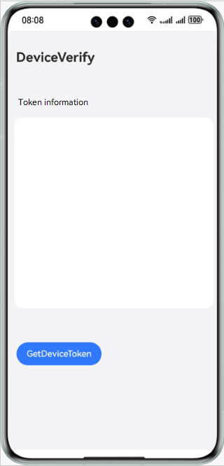

# 设备安全服务-应用设备状态检测

## 介绍

本示例向您介绍如何在应用中获取DeviceToken用于对应用的设备状态进行检测。

需要使用设备安全服务接口 **@kit.DeviceSecurityKit**。

## 效果预览

## Sample工程的配置与使用

### 在DevEco中配置Sample工程的步骤如下

1. [创建项目](https://developer.huawei.com/consumer/cn/doc/app/agc-help-createproject-0000001100334664)及[应用](https://developer.huawei.com/consumer/cn/doc/app/agc-help-createapp-0000001146718717)。
2. 打开Sample应用，使用[AppGallery Connect](https://developer.huawei.com/consumer/cn/service/josp/agc/index.html)配置的应用包名替换app.json5文件中的bundleName属性值。
4. 在[AppGallery Connect](https://developer.huawei.com/consumer/cn/service/josp/agc/index.html)开通Device Security服务，具体请参考[Device Security Kit开发指南](https://developer.huawei.com/consumer/cn/doc/harmonyos-guides-V5/devicesecurity-introduction-V5)。

#### Sample工程使用说明
1. 运行该 Sample 应用前，先对设备进行联网。
2. 运行该 Sample 应用，依次点击"GetDeviceToken"按钮获取设备deviceToken，如果获取成功，页面会显示DeviceToken信息，如果获取失败，页面会显示相应的错误码。

## 工程目录
├─entry/src/main/ets            // 代码区  
│ ├─entryability                    
│ │ └─EntryAbility.ets          // 程序入口类  
│ ├─model                
│ │ └─DevCertManagerModel.ts    // DeviceToken获取类  
│ ├─pages                                     
│ │ └─Index.ets              // 首页，获取deviceToken页面

## 具体实现

本示例展示获取DeviceToken的功能在页面中直接调用，使用deviceCertificate.getDeviceToken()方法获取当前设备的DeviceToken信息，源码参考DevCertManagerModel.ts

参考
1. entry\src\main\ets\entryability\EntryAbility.ets
2. entry\src\main\ets\model\DevCertManagerModel.ts
3. entry\src\main\ets\pages\Index.ets

## 相关权限

不涉及。

## 依赖

依赖设备联网。

## 约束与限制

1.本示例仅支持标准系统上运行，支持设备：华为手机、华为平板和华为2in1设备。

2.HarmonyOS系统：HarmonyOS NEXT Developer Beta1及以上。

3.DevEco Studio版本：DevEco Studio NEXT Developer Beta1及以上。

4.HarmonyOS SDK版本：HarmonyOS NEXT Developer Beta1 SDK及以上。