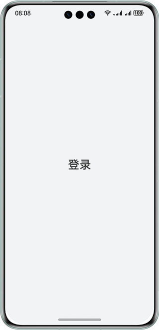
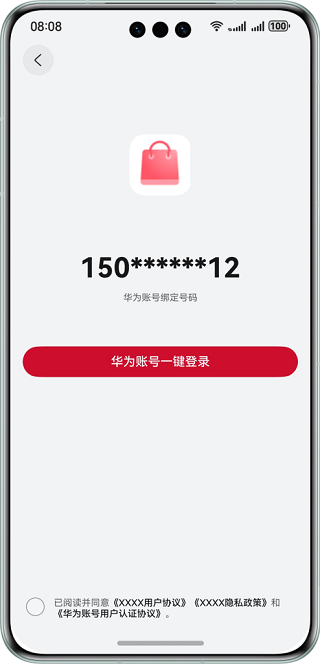
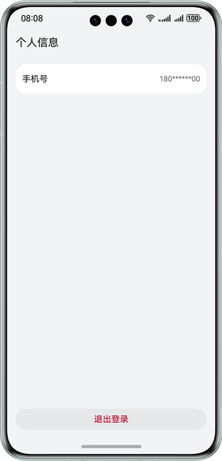

# 华为账号一键登录

## 介绍

本示例展示了使用Account Kit提供的华为账号一键登录的能力。

本示例模拟了在应用里，调用一键登录Button组件拉起符合华为规范的登录页面进行登录的场景。

需要使用Account Kit接口 **@kit.AccountKit**。

## 效果预览

| **登录页面**                                | **华为帐号一键登录页**                           | **个人信息页**                               |
|-----------------------------------------|-----------------------------------------|-----------------------------------------|
|  |  |  |

## 本示例工程的配置与使用

### 在DevEco中配置本示例工程的步骤如下

1. [创建项目](https://developer.huawei.com/consumer/cn/doc/app/agc-help-createproject-0000001100334664)及[应用](https://developer.huawei.com/consumer/cn/doc/app/agc-help-createharmonyapp-0000001945392297)。
2. 在[华为开发者联盟](https://developer.huawei.com/consumer/cn/)为应用配置权限（权限名：quickLoginMobilePhone），具体操作可参考[Account Kit开发指南](https://developer.huawei.com/consumer/cn/doc/harmonyos-guides-V5/account-config-permissions-V5)。
3. 打开本示例，使用[AppGallery Connect](https://developer.huawei.com/consumer/cn/service/josp/agc/index.html)配置的应用包名替换app.json5文件中的bundleName属性值。 
4. 使用[AppGallery Connect](https://developer.huawei.com/consumer/cn/service/josp/agc/index.html)配置的应用Client ID替换module.json5文件中的client_id属性值。 
5. 生成SHA256应用签名证书指纹并添加到[AppGallery Connect](https://developer.huawei.com/consumer/cn/service/josp/agc/index.html)对应的应用配置中，请参考应用开发准备中的[配置签名信息](https://developer.huawei.com/consumer/cn/doc/harmonyos-guides-V5/application-dev-overview-V5#section42841246144813)及[添加公钥指纹](https://developer.huawei.com/consumer/cn/doc/harmonyos-guides-V5/application-dev-overview-V5#section1726913517284)章节。

### 本示例工程使用说明

1. 运行本示例，如系统已登录注册地为中国境内（不包含中国香港、中国澳门、中国台湾）且已绑定手机号的华为账号，应用在申请到“华为账号一键登录”权限后，点击“登录”，会拉起嵌有“华为账号一键登录”按钮的登录页面，否则会弹出相应错误提示。
2. 在嵌有“华为账号一键登录”按钮的登录页面中，点击《华为账号用户认证协议》，可跳转至协议页面。
3. 登录成功后，会进入个人信息页面。个人信息页面的手机号仅用于展示，不可点击修改。在个人信息页点击退出登录，即可重新体验华为账号一键登录功能。

## 工程目录

```
├─entry/src/main/ets        // 代码区
│ ├─common  
│ │ └─Constants.ets         // 存放常量
│ │ └─ShowToast.ets         // 弹出提示的公共方法
│ ├─entryability  
│ │ └─EntryAbility.ets      // 程序入口类
│ ├─pages                   // 存放页面文件目录
│ │ └─HomePage.ets          // 主页面，作为Navigation跳转的容器
│ │ └─PersonalInfoPage.ets  // 个人信息页，包含手机号、退出登录按钮的展示
│ │ └─PrepareLoginPage.ets  // 首页内容，包括获取匿名手机号等场景 
│ │ └─ProtocolWebView.ets   // 华为账号用户认证协议页面
│ │ └─QuickLoginPage.ets    // 华为账号一键登录页面
└──entry/src/main/resources // 资源文件目录
```

## 具体实现

在Constants中存放常量，参考Constants.ets：
* 包含通用错误码

在ShowToast中存放弹出提示的公共方法，参考ShowToast.ets：
* 使用promptAction.showToast()弹出提示

使用HomePage作为Navigation容器进行页面承载，参考HomePage.ets：
* 使用NavPathStack配合navDestination属性进行页面路由

使用PrepareLoginPage作为应用首页，参考PrepareLoginPage.ets：
* 使用authentication.HuaweiIDProvider().createAuthorizationWithHuaweiIDRequest()创建授权请求，获取匿名手机号
* 使用authentication.AuthenticationController()创建controller
* 调用controller.executeRequest()执行请求

调用一键登录组件拉起符合华为规范的登录页面，功能在QuickLoginPage中，参考QuickLoginPage.ets：
* 使用loginComponentManager.PrivacyText创建QuickLoginPage隐私文本对象privacyText
* 使用loginComponentManager.LoginWithHuaweiIDButtonController构造QuickLoginPage的控制器对象controller
* 使用setAgreementStatus方法设置用户是否同意协议，通过该状态判断是否能够执行一键登录
* 通过LoginWithHuaweiIDButton组件内设置param中的extraStyle属性开启一键登录按钮的点击加载态

在ProtocolWebView页面中使用Web组件显示《华为账号用户认证协议》内容：
* 在data.json中获取网页链接

使用PersonalInfoPage中作为个人信息页，参考PersonalInfoPage.ets：
* 退出登录后，使用pushPathByName方法进行页面跳转

参考
1. entry\src\main\ets\common\Constants.ets
2. entry\src\main\ets\common\ShowToast.ets
3. entry\src\main\ets\pages\HomePage.ets
4. entry\src\main\ets\pages\PersonalInfoPage.ets
5. entry\src\main\ets\pages\PrepareLoginPage.ets
6. entry\src\main\ets\pages\ProtocolWebView.ets
7. entry\src\main\ets\pages\QuickLoginPage.ets

## 相关权限

1. 本示例需要访问《华为账号用户认证协议》页面，已在 module.json5 文件中添加网络权限" ohos.permission.INTERNET"。
2. 本示例在跳转华为账号用户认证协议页面前需要判断当前设备是否连接网络，已在module.json5文件中添加获取数据网络信息权限"ohos.permission.GET_NETWORK_INFO"。

## 依赖

依赖设备具备WIFI能力

## 约束与限制

1. 本示例仅支持标准系统上运行，支持设备：华为手机、2in1、平板，支持账号：已绑定手机号的中国境内（不包含中国香港、中国澳门、中国台湾）成人账号。
2. 本示例不支持大字体模式、横屏模式、隐私空间模式、深色模式，多语言仅支持中英文。
3. HarmonyOS系统：HarmonyOS Next Beta1及以上。
4. DevEco Studio版本：DevEco Studio Next Beta1及以上。
5. HarmonyOS SDK版本：HarmonyOS Next Beta1及以上。 
