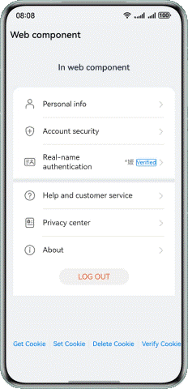

# Web Cookie Operations

### Introduction

This codelab uses ArkTS to implement a simple login-free process and introduces basic cookie operations.

### Concepts

- Web: displays web pages.
- WebCookieManager: manages behavior of cookies in **Web** components. All **Web** components in an application share a **WebCookieManager** instance.

### Permissions

Network permission: **ohos.permission.INTERNET**.

### How to Use

1. Connect your device to the network. The HarmonyOS official website login page is displayed on the home screen.

2. Tap the cookie read button to obtain the current cookie information, which is displayed in a dialog box.

3. Tap the cookie setting button to set the cookie information. If the setting is successful, a message appears indicating that the cookie is written successfully. Tap the cookie read button. A dialog box appears showing that "info=Test cookie write".

4. Tap the cookie verification button to redirect to another page. If you have logged in successfully on the home page, you will be redirected to the About page in Account Center. If you have not logged in, you will be redirected to the login page.

### Constraints

1. The sample is only supported on Huawei phones with standard systems.

2. HarmonyOS: HarmonyOS 5.0.0 Release or later.

3. DevEco Studio: DevEco Studio 5.0.0 Release or later.

4. HarmonyOS SDK: DevEco Studio 5.0.0 Release SDK or later.
