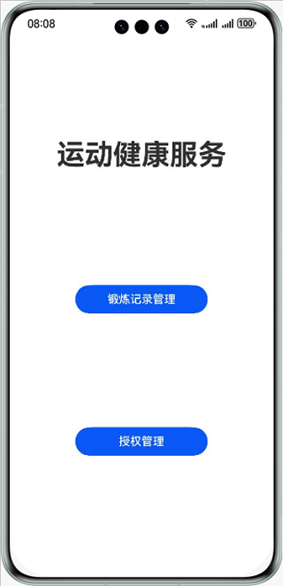

# 华为运动健康服务

## 介绍

本示例展示了使用华为运动健康数据服务提供的授权管理，锻炼记录管理。

需要使用华为运动健康数据服务接口 **@kit.HealthServiceKit**。

## 效果预览

| **示例应用主页面**                         | **授权管理页面**                            | **锻炼记录管理页面**                          |
|-------------------------------------|---------------------------------------|---------------------------------------|
|  |  |  |

## Sample工程的配置与使用

### 在DevEco中配置Sample工程的步骤如下

1. [创建项目](https://developer.huawei.com/consumer/cn/doc/app/agc-help-createproject-0000001100334664)及[应用](https://developer.huawei.com/consumer/cn/doc/app/agc-help-createapp-0000001146718717)。
2. [申请运动健康服务](https://developer.huawei.com/consumer/cn/doc/harmonyos-guides/health-apply-0000001770425225)。
3. 打开Sample应用，使用[AppGallery Connect](https://developer.huawei.com/consumer/cn/service/josp/agc/index.html)配置的应用包名替换AppScope\app.json5文件中的bundleName属性值。
4. 使用[AppGallery Connect](https://developer.huawei.com/consumer/cn/service/josp/agc/index.html)配置的应用client_id替换entry\src\main\module.json5文件中的client_id属性值。
5. 生成SHA256应用签名证书指纹并添加到[AppGallery Connect](https://developer.huawei.com/consumer/cn/service/josp/agc/index.html)对应的应用配置中，证书指纹生成请参考Health Service Kit开发指南中开发准备下的配置应用签名证书指纹章节。

#### Sample工程使用说明
1. 运行该 Sample 应用，首先点击"授权管理"按钮，进入授权管理页面，点击"授权"按钮进行登录/授权操作，如果系统账号未登录，会拉起华为账号登录页，用户登录后拉起授权页面。
2. 完成授权后，回到主界面，点击"锻炼记录管理"按钮，进入相应的页面，管理锻炼记录。

## 工程目录
├─entry/src/main/ets         // 代码区  
│ ├─common  
│ │ ├─bean  
│ │ │ ├─AuthManagement.ets               // 授权接口  
│ │ │ └─ExerciseSequenceManagement.ets  // 锻炼记录接口  
│ │ ├─utils   
│ │ │ └─DateUtil.ets                     // 时间工具类  
│ ├─entryability                
│ │ └─EntryAbility.ets                    // 程序入口类  
│ ├─pages              
│ │ ├─MainIndex.ets                       // 主页面  
│ │ ├─AuthIndex.ets                       // 授权管理页面  
│ │ └─ExerciseSequenceIndex.ets           // 锻炼记录管理页面  
└─entry/src/main/resources                // 资源文件目录  

## 具体实现

授权相关功能，参考AuthManagement.ets：
* 使用AuthorizationRequest类型创建授权请求，设置待授权的读数据类型、写数据类型，调用requestAuthorizations方法，拉起登录/授权页面
* 使用AuthorizationRequest类型创建查询权限请求，设置待查询的读数据类型、写数据类型，调用getAuthorizations方法，查询是否具有数据类型权限
* 调用cancelAuthorizations方法，取消授权

锻炼记录，参考ExerciseSequenceManagement：
* 构造单条数据或多条数据数组，调用saveData方法完成数据的保存
* 设置数据查询条件，调用readData方法，读取运动健康数据
* 设置删除数据条件，调用deleteData方法，删除运动健康数据
* 指定单条数据或多条数据数组，调用deleteData方法，删除运动健康数据

参考
1. entry\src\main\ets\common\bean\AuthManagement.ets
2. entry\src\main\ets\common\bean\ExerciseSequenceManagement.ets

## 依赖

依赖设备具备WIFI能力

## 约束与限制

1. 本示例仅支持标准系统上运行，支持设备：华为手机、华为平板。
2. 首次使用华为运动健康服务前，必须打开运动健康App，同意隐私授权。
3. HarmonyOS系统：HarmonyOS Next Developer Beta1及以上。
4. DevEco Studio版本：DevEco Studio Next Developer Beta1及以上。
5. HarmonyOS SDK版本：HarmonyOS Next  Developer Beta1及以上。