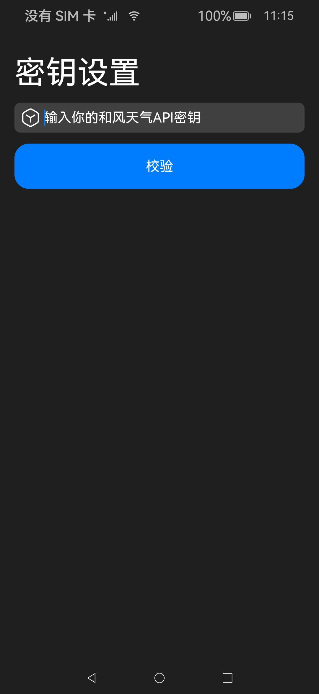
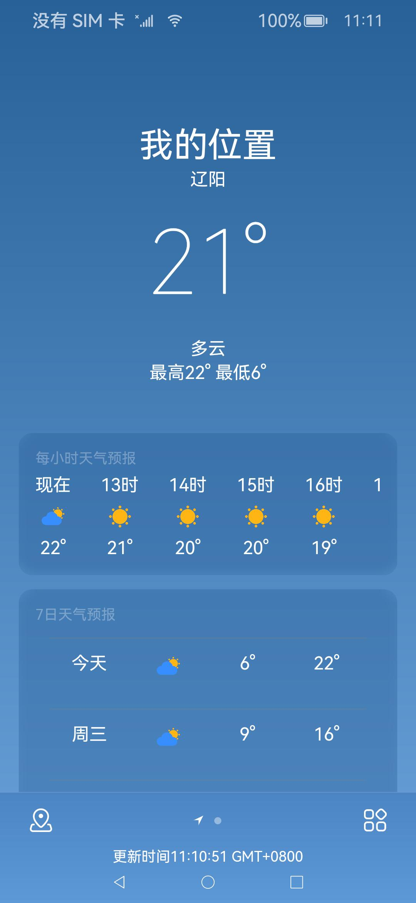
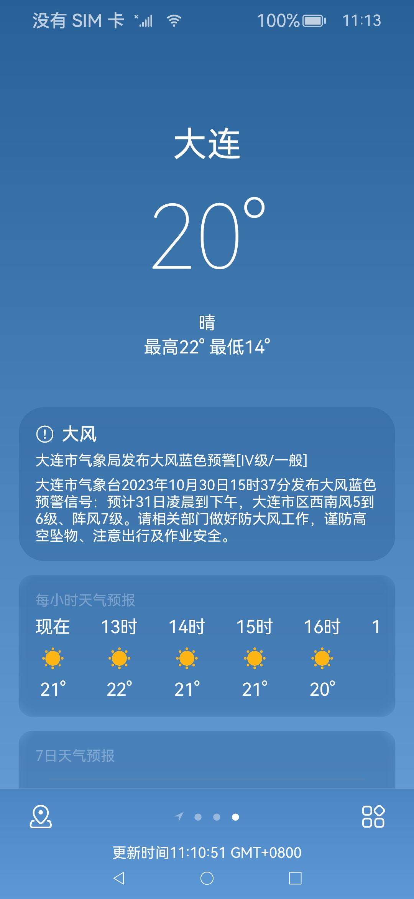
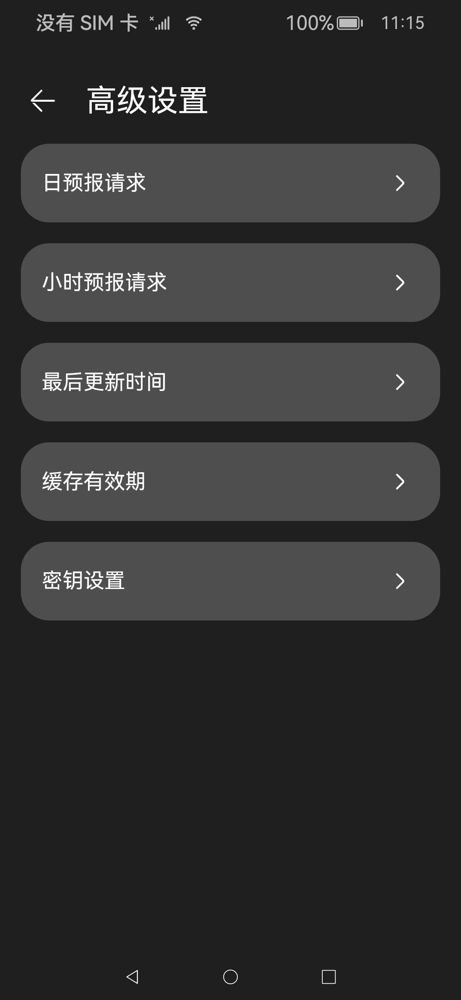
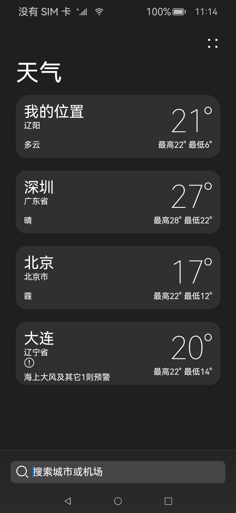
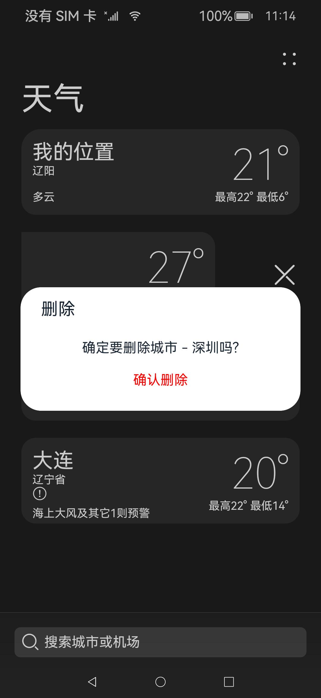
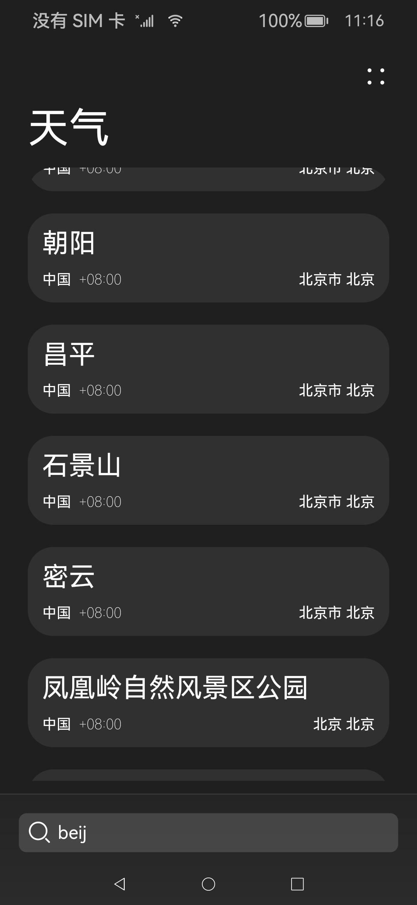
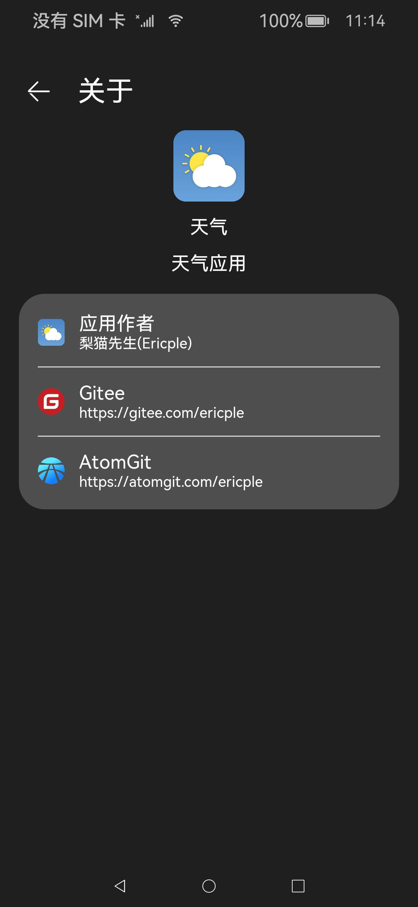
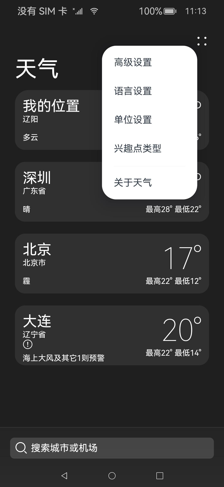

<div align="center" style="margin-top: 72px;">
    
    <h2>OHOS-WEATHER</h2>
</div>

## 项目介绍

本项目是兴趣作品，功能为向用户提供天气预报，数据来源于[和风天气](https://www.qweather.com/)
，界面风格基于iOS设计进行了改进，图标来源分别为：鸿蒙图标库、和风天气、自绘。本应用功能已基本完善，若有其它功能构思，欢迎提交pr共同探讨。

## 应用下载

- 请移步[此处获取最新Release](https://gitee.com/ericple/ohos-weather/releases)。

## 应用截图











## 功能清单

> 以下清单内功能均已完整实现

- 首页
    - 位置服务
    - 实时天气服务
    - 每小时预报服务
    - 每日预报服务
- 气象地图 - Windy
- 天气列表页
    - 地区列表服务
    - 地区搜索服务
    - 地区添加服务
    - 地区删除服务
- 设置项
    - 普通设置
        - 语言设置
        - 单位设置
        - [兴趣点](#名词释义)设置
    - 高级设置
        - [日预报请求数](#名词释义)
        - [小时预报请求数](#名词释义)
        - [最后更新时间](#名词释义)重置
        - [缓存有效期](#名词释义)设置
        - 密钥设置

> 如果有好的想法，欢迎提交pr共同讨论在本应用内的可行性

## 待开发功能

- 天气展示页
    - 模块化、可编辑的气象信息展示组件
- 桌面
    - 桌面气象卡片

## 使用建议

> 在首页双击即可强制刷新气象数据

- 如果设备暂不支持GPS(例如：One plus 6T)
  ，请在第一次打开应用时拒绝有关定位的权限申请以缩短加载时间。不必担心，无法使用GPS进行精确定位时，OHOS-WEATHER将会使用网络地址进行定位，仍然可以正常使用本软件的天气服务。
- 尽量不要修改高级设置中除了`密钥设置`以外的内容，它们是脆弱的，如果不加考虑地修改，可能会破坏软件的使用体验。
- 在第一次开启软件时，将会跳转到`API Key设置`
  界面，如果可能，请尽量提前准备好和风天气的API密钥，如果还没有该密钥，可以前往[和风天气](https://id.qweather.com/#/register)
  进行注册。不必担心费用，**和风天气为个人提供免费密钥**，可以利用该密钥使用本软件。
- 如果你有和风天气的付费许可，并且决心使用更高级的服务，你可以前往高级设置中将`日预报请求`及`小时预报请求`
  的数量调整至你API密钥被许可的最大值
- 我非常不建议调整默认的`缓存有效期`
  ，天气数据缓存是为了节约你的API密钥使用次数，对于免费的访问许可，和风做出了每日1000次的请求限制。如果你执意要将`缓存有效期`
  调整至一个较小值，我建议将该值限制在10分钟以上，因此在设置选项中，你将看到最低10分钟的限制。

## 开发环境

- DevEco Studio 4.0.0.600 Release
- SDK 3.2.14.6 API9
- OpenHarmony 3.2.14.6 fajita

**针对HarmonyOS的警告：**

> 本项目未曾运行在HarmonyOS上，使用HarmonyOS运行本项目时遇到任何问题，请在issue标题中标注[HarmonyOS]

## 开发模式

本项目有两个分支，其中**beta分支为活跃分支**，请issuer向beta分支发起pr以及open issue。当beta中的功能趋于稳定时，
代码将会从beta被push进入stable分支，同时，从stable分支产生Release版本供用户下载。

> 请开发者不要向stable分支发起pr，所有目标为stable的pr将会直接被拒。

## 特别鸣谢

- 感谢[@韦行志](https://gitee.com/wathinst)先生将OpenHarmony操作系统移植到一加6T上，使我能够以更低的成本购入一块能够进行开源鸿蒙应用开发的富设备
- 感谢[@韦行志](https://gitee.com/wathinst)先生的[OH-BILI](https://gitee.com/ohos_port/ohbili)
  项目，通过参与该项目的开发，我获得了许多有关并发请求的知识
- 感谢[@westinyang](https://gitee.com/westinyang)创建的[OHOS-DEV组织](https://gitee.com/ohos-dev)
  ，相逢即是缘，作为一个兴趣驱动的人，没有什么事情是比遇到一群志同道合的朋友更令人振奋的
- 感谢日夜钻研开源鸿蒙系统应用源代码的自己，通过浏览系统应用的源代码，我了解到了更多ArkTS的代码规范，总结了许多开发经验，形成了基本符合编码规范的个人代码风格

## ISSUE规范

在提出ISSUE前，请确保熟悉以下内容，并将其添加到issue内容中：

- 设备型号
- 设备所运行的操作系统/版本
- 发生异常的具体描述
- 发生异常前的操作
- 若不发生异常，您认为应该出现的现象
- [DevEco设备调试LOG](#log搜索)

## LOG搜索

OHOS-WEATHER自带LOGGER模块，每一条由OHOS-WEATHER所生成的LOG都会附带”NMC_LOGGER“字样，
如果发生异常，请将设备连接至电脑，并在HiLog中筛选出带有该字样的LOG，随附在提交的ISSUE中

## 名词释义

- 兴趣点(POI)

POI全称为Point of interest，其设置项结构为：

```typescript
const POI_TYPE = {
  NAME: 'search_poi_type',
  DEFAULT: 'scenic',
  RANGE_DISPLAY: ['景点', '潮流站点', '潮汐站点'],
  RANGE_SET: ['scenic', 'CSTA', 'TSTA']
}
```

它决定了在搜索过程中获取的额外类型，默认为`scenic`，即景点。

- 日预报请求数

日预报请求数是指城市天气预报中，每日天气预报请求的天数。
对于免费API密钥，可请求的最大天数为7日，故本应用默认的`日预报请求数`也为7，其设置项结构为：

```typescript
const REQUEST_DAY_NUM = {
  NAME: 'forecast_day_num',
  DEFAULT: 7,
  RANGE_DISPLAY: ["3日", "7日", "10日", "15日", "30日"],
  RANGE_SET: [3, 7, 10, 15, 30]
}
```

- 小时预报请求数

小时预报请求数是指城市天气预报中，逐小时天气预报请求的小时数。
对于免费API密钥，可请求的最大小时数为24小时，故本应用默认的`小时预报请求数`也为24，其设置项结构为：

```typescript
const REQUEST_HOUR_NUM = {
  NAME: 'forecast_hour_num',
  DEFAULT: 24,
  RANGE_DISPLAY: ["24小时", "72小时", "168小时"],
  RANGE_SET: [24, 72, 168]
}
```

- 最后更新时间

最后更新时间是指用户最后一次主动更新，或软件自身最后一次主动更新气象信息的时间，该时间会显示在首页底部。
软件会根据该时间以及`缓存有效期`，来判断是否消耗API密钥请求次数，从网络获取气象信息。如果缓存未失效，则软
件会从本地缓存中读取相应城市的气象信息。

- 缓存有效期

缓存有效期是指气象信息缓存的有效期，在开启应用时，应用会先读取最后更新时间，进而判断当前缓存是否有效。若缓存失效，
则软件会消耗API密钥请求次数，从网络获取最新的气象信息。
气象信息是具有时效性的信息，目前软件使用的缓存策略为所有信息均使用统一缓存有效期，为确保信息时效，建议不要
将该值调整到1小时以上。